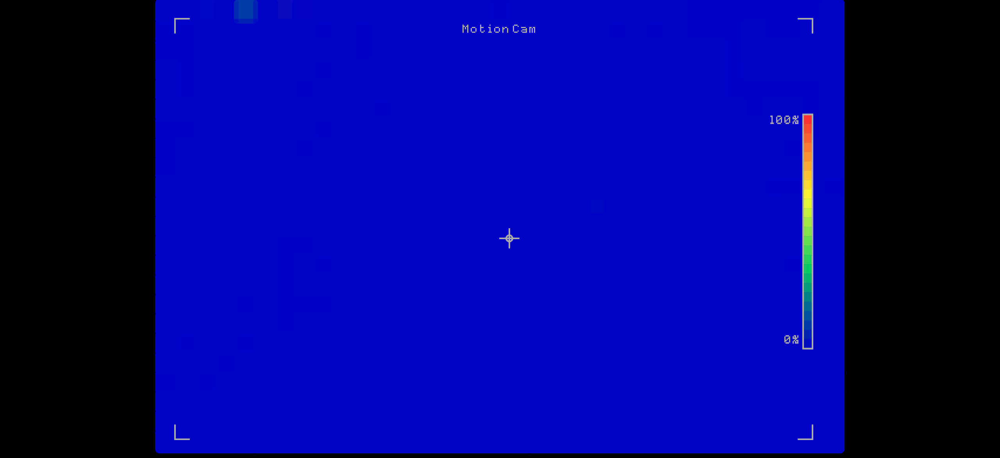
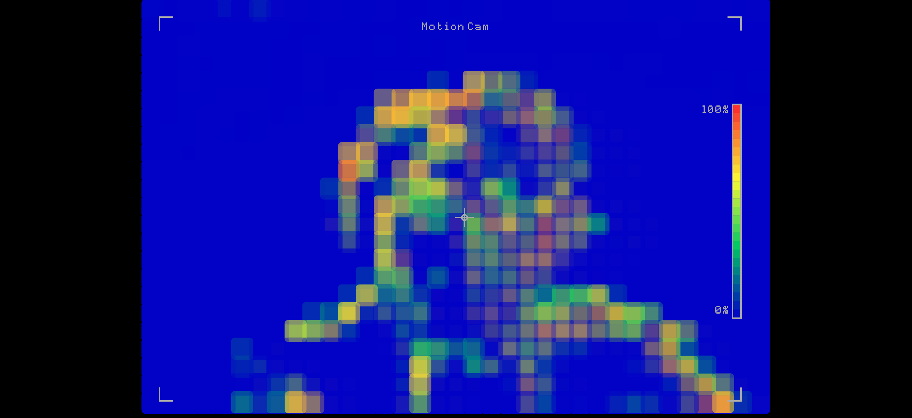
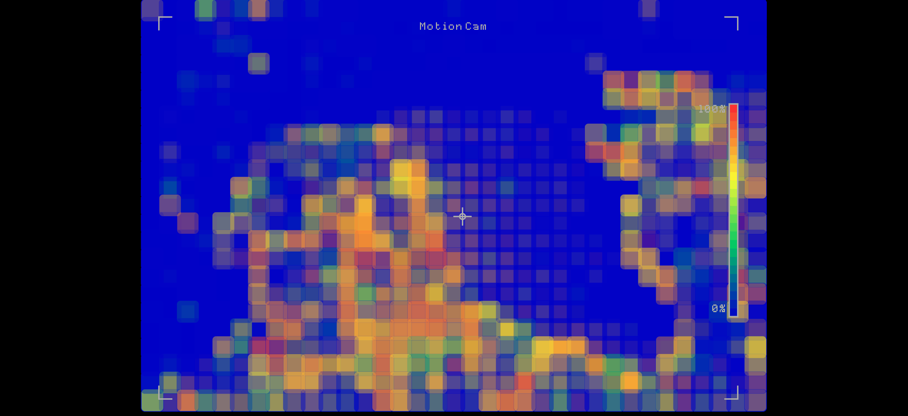

# Motion Cam
Motion-tracking camera inspired by thermal camera

### Description
This project uses optical flow to calculate motion from your webcam and translates it into color. The resulting video is made of squares for a sort of pixelated look. The squares are gradually colored red to blue, from most/fastest movement to no movement, and leave a faint trail behind any movement. The project can run fullscreen and rescales with the window if it is resized.
